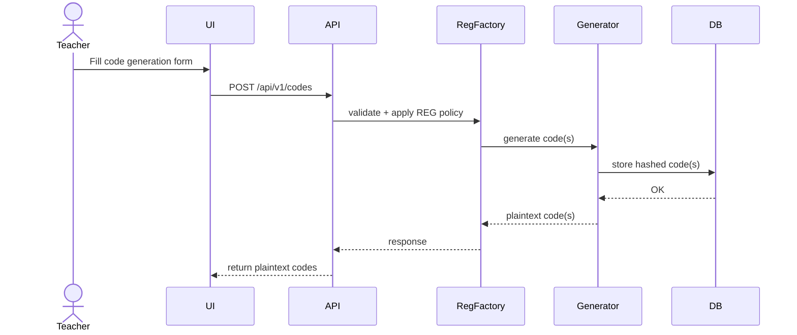
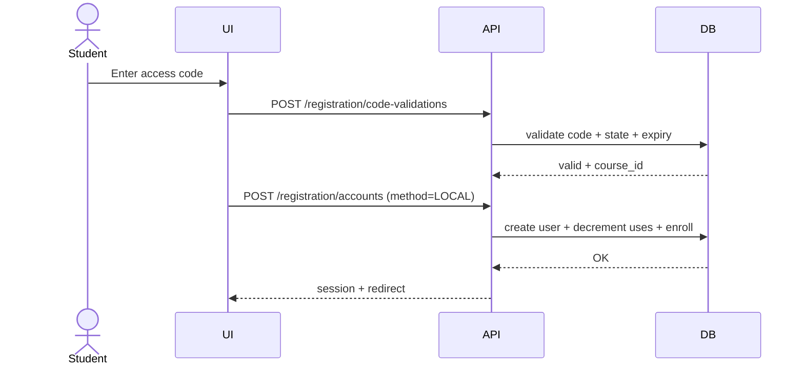
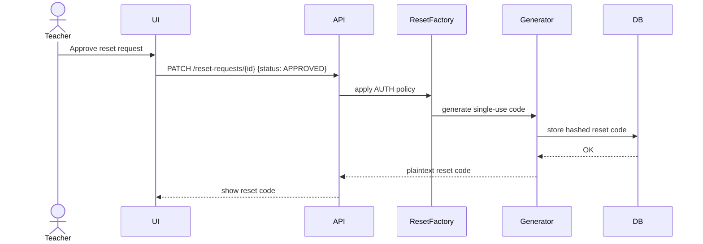

# Code Generation — Low-Level Design (Draft v1)

| Field | Value |
|-------|-------|
| **Status** | DRAFT |
| **Date** | 2026-02-10 |
| **Scope** | Shared code generation for REG + AUTH |
| **Related FRs** | FR-01 (AUTH), FR-02 (REG) |

---

## 1) Purpose

Define the low-level architecture for **code generation** used by:
- **Registration codes (REG)** — multi-use, persistent, revokable/archivable
- **Reset codes (AUTH)** — short-lived, single-use, not archived

The implementation should share core logic while enforcing domain-specific constraints.

---

## 2) Design Goals

- **Single generator, multiple policies** (no code “types”)
- Clear **policy-driven validation** (expiry, uses, storage)
- **Transactional issuance/consumption** for safety
- **Extensible** for future codes without refactors
- **Audit-friendly** without storing plaintext codes

---

## 3) Non-Goals

- No SMTP invite flow
- No admin self-registration
- No external identity providers beyond OAuth
- No analytics / reporting system for codes in v1

---

## 4) Components

### 4.1 Core Generator

`CodeGenerator`
- Generates random codes using configured entropy rules
- Hashes codes for storage
- Returns plaintext codes once for display

### 4.2 Policy

`CodePolicy`
- Defines behavior for a specific domain use
- Includes: `expiry_required`, `uses_per_code`, `storage_mode`, `revokable`, `archivable`, `course_link_required`, `single_use_only`

### 4.3 Factories (Domain Wrappers)

`RegistrationCodeFactory`
- Applies **REG** policy
- Validates count + uses
- Ensures course linkage for teacher student codes
- Allows metadata attachment (single code only)

`ResetCodeFactory`
- Applies **AUTH** policy
- Single-use only
- Short expiry (default 30 minutes)
- No archival or persistent lifecycle

### 4.4 Storage

**Registration codes:** persistent table, lifecycle states  
**Reset codes:** temporary table or cache (no archival)

---

## 5) Data Model (Sketch)

### RegistrationCode
- `id`
- `hashed_code`
- `target_role`
- `creator_id`
- `uses_total`
- `uses_remaining`
- `expires_at`
- `status` (ACTIVE, EXHAUSTED, EXPIRED, REVOKED, ARCHIVED)
- `course_id` (student codes only)
- `metadata` (optional)

### ResetCode
- `id`
- `hashed_code`
- `request_id`
- `expires_at`
- `used_at` (nullable)

### ResetRequest
- `id`
- `request_token` (shown once)
- `requester_id`
- `approver_id` (nullable)
- `status` (PENDING, APPROVED, DENIED, EXPIRED)
- `expires_at`

---

## 6) Sequence Diagrams (Mermaid)

### 6.1 Generate Registration Code (Teacher)

### 6.2 Register with Code (Student)

### 6.3 Approve Reset (Teacher)

---

## 7) Error Handling Principles

- Validation errors are surfaced at the **policy layer**, not the generator
- Generator should only fail on entropy or storage errors
- All create/consume flows must be **transactional**

---

## 8) Implementation Notes

- **Plaintext codes** are returned once to UI; only hashes stored
- **Reset codes** should be cleaned up on use/expiry
- **Registration code state** is always derived from uses + expiry + actions
